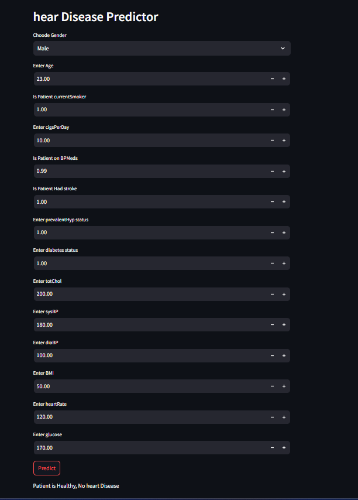

# Heart Disease Prediction

This is a Machine Learning web application built using Streamlit.  
The model predicts the possibility of heart disease based on health parameters.

## Technologies Used
- Python
- Streamlit
- Scikit-learn
- Pandas
- NumPy

## Run Locally

```bash
pip install -r requirements.txt
streamlit run app.py
```

## Application Screenshot

